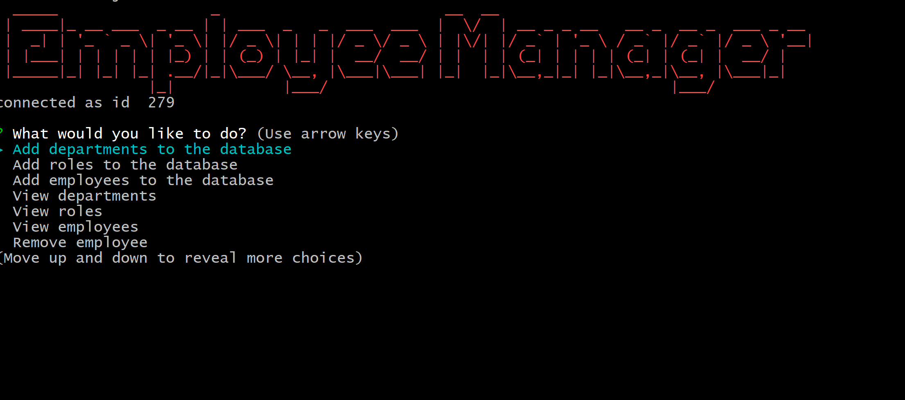
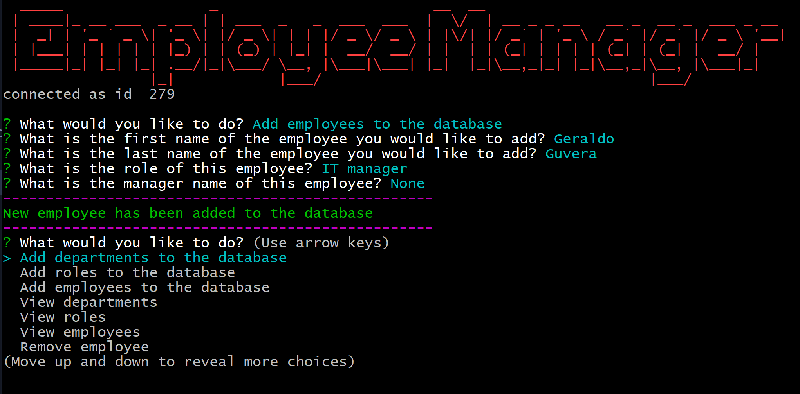
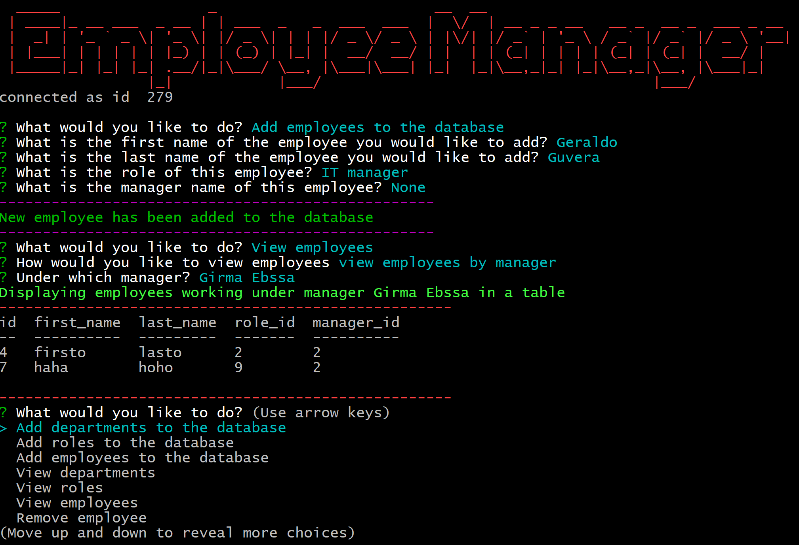

# Employee Trucker 

* View the [Github Repo](https://github.com/girmaD/Employee_Tracker)

## Description
  This application is a node CLI application built mainly using inquirer and mysql packages. It enables a user to retrieve as well as manipulate a company's database. The database contains employee, role and department tables. Each table is connected to the other with a foreign key. Using this application, a user can view, insert, update and delete data on all of the three tables. In essence, this application makes all the CREATE, READ, UPDATE and DELETE (CRUD) functions possible while persisting the data on MySQL databse.

  The application provides choices on what a user can do. Then user can then select what she/he intends to do and answer each prompted question to be able to get the intended effect on the database. When the database is affected, a command line notification will be displayed summerizing what happened. If a user chose to view any of the data, the data will be displayed in a table.

  The application also uses chalk, console-table and figlet npm packages so that the output is displayed in a better way on the terminal. dotenv package is used to secure sensitive database related information.

## Table Of Contents 
* [Installation Instructions](#Installation-Instructions)
* [How To Use The App](#How-To-Use-The-App)
* [Contributing Guidelines](#Contributing-Guidelines)
* [Test Information](#Test-Information)
* [License](#License)
* [Questions](#Questions)

## Installation Instructions

 * fork and use it.
 * Don't forget to install all the modules this app depends on.
 * npm i -> will insall the dependecies

## How To Use The App
- Launch the app either on the terminal - using (node index.js)
- A list of activities related to the data will be populated.
- Select the activity you would like to do using down/up arrow keys.
- Answer each questions prompted to you and when it is done - the result of the activity will be displayed on the console.

- If you choose an activity that affects the data such as add, update or delete - a notification will be displayed once the effect takes place.
- As an example, if a user chooses to add employee to the database, notification saying *New employee has been added to the database* will appear on the console once adding the employee is completed.

- If a user, chooses to view a data, the data will be displayed in a table. As an example, if a user chooses to view employees under a certain manager, the data will be displayed as follows: 

- To exit the app, select *Exit* from a list of choice of activities.

## Contributing Guidelines
 * contact me on the email provided below

## Test Information
  * No test specified

## License

 * MIT

## Questions

Should you have any questions about this project,
  * you can reach me through email: [girma.derib@gmail.com](mailto:girma.derib@gmail.com) 
  * or visit my [Github Profile](https://github.com/girmaD) for more information.
